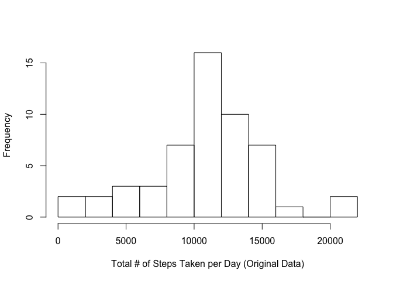
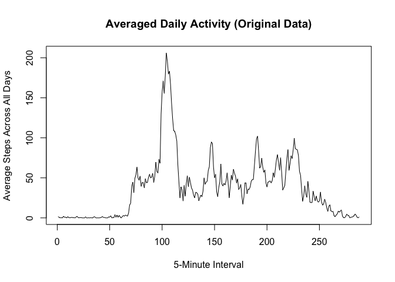
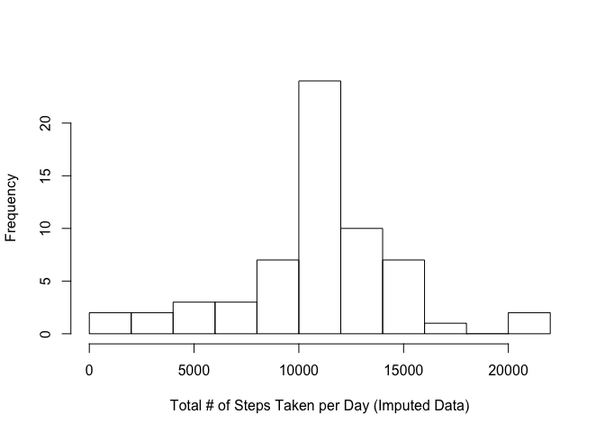
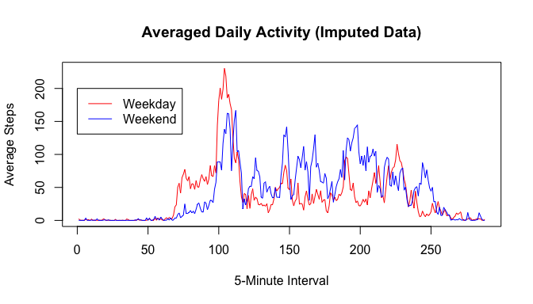

# Reproducible Research: Peer Assessment 1

## Loading and preprocessing the data


```r
setwd('/Users/Xiaojian/Coursera_reproducible_research')
act.all <- read.csv('activity.csv', header = TRUE, as.is = TRUE)
# dataset without missing steps
act <- act.all[complete.cases(act.all), ]
```

## What is mean total number of steps taken per day?


```r
# missing values in the dataset was ignored
# total number of steps taken per day
tot <- tapply(act$steps, act$date, sum)
summary(tot)
```

```
##    Min. 1st Qu.  Median    Mean 3rd Qu.    Max. 
##      41    8841   10760   10770   13290   21190
```

```r
# histogram of the total number of steps taken per day
hist(tot, nclass = 15, main = '', 
     xlab = 'Total # of Steps Taken per Day (Original Data)')
```

<!-- -->

```r
# mean and median of the total number of steps taken per day
mean.tot <- mean(tot)
med.tot <- median(tot)
```
The mean is 1.0766189\times 10^{4}, and the median is 10765. 

## What is the average daily activity pattern?


```r
# missing steps was ignored
mean.int <- tapply(act$steps, act$interval, mean)
int <- as.integer(names(mean.int))
# re-order the mean steps by their measured time
mean.int <- mean.int[order(int)]

# average daily activity
plot(mean.int, type = 'l', main = 'Averaged Daily Activity (Original Data)', 
     xlab = '5-Minute Interval', 
     ylab = 'Average Steps Across All Days')
```

<!-- -->

```r
max.int <- names(mean.int)[which.max(mean.int)]
```
The 5-minute interval, 835, contains the maximum number of steps averaged across all days. 

## Imputing missing values

Only the column contains `steps` missing values

```r
apply(act.all, 2, function(u){sum(is.na(u))})
```

```
##    steps     date interval 
##     2304        0        0
```
We impute a missing step by the means for that 5-minute interval

```r
# IDs for rows with NA
id.na <- which(is.na(act.all$steps))
n.na.ori <- length(id.na)

# creating a new dataset
# imputing missing steps by mean steps for that 5-minute interval
act.imp <- act.all
act.imp$steps[id.na] <- 
  mean.int[as.character(act.imp$interval[id.na])]
n.na.imp <- sum(!complete.cases(act.imp))
```

Originally there are 2304 rows in the dataset `act.all` with `NA`. After imputation, 0 row of `act.imp` contains a missing value. 


```r
tot.imp <- tapply(act.imp$steps, act.imp$date, sum)

# histogram of the total number of steps taken per day
hist(tot.imp, nclass = 15, main = '', 
     xlab = 'Total # of Steps Taken per Day (Imputed Data)')
```

<!-- -->

```r
summary(tot.imp)
```

```
##    Min. 1st Qu.  Median    Mean 3rd Qu.    Max. 
##      41    9819   10770   10770   12810   21190
```

```r
mean(tot.imp) == mean.tot
```

```
## [1] TRUE
```

```r
median(tot.imp) == med.tot
```

```
## [1] FALSE
```
The mean and median of total number of steps taken per day that calculated from the imputed dataset are 1.0766189\times 10^{4} and 1.0766189\times 10^{4}, respectively. The means are the same as those calculated from original data, but the medians differ. 

Imputing missing data as above let us to estimate the total number of steps for some days that do not have any observations

```r
length(tot.imp) > length(tot)
```

```
## [1] TRUE
```
Meanwhile, for those days that contains observation from at least one observed 5-minute interval, using imputed data leads to a higher estimate of total number of steps per day

```r
name <- intersect(names(tot.imp), names(tot))
all(tot.imp[name] >= tot[name])
```

```
## [1] TRUE
```

## Are there differences in activity patterns between weekdays and weekends?


```r
# we did not use built-in function weekdays()
day <- c('06', '07', '13', '14', '20', '21', '27', '28', 
         '03', '04', '10', '11', '17', '18', '24', '25')
mon <- rep(10:11, each = 8)
we <- paste('2012', mon, day, sep = '-')

act.imp$day <- ifelse(act.imp$date %in% we, 'weekend', 'weekday')
id.we <- which(act.imp$day == 'weekend')

# for weekend days
mean.int.we <- 
  tapply(act.imp$steps[id.we], act.imp$interval[id.we], mean)
int.we <- as.integer(names(mean.int.we))
mean.int.we <- mean.int.we[order(int.we)]

# for weekdays
mean.int.wd <- tapply(act.imp$steps[-id.we], 
                           act.imp$interval[-id.we], mean)
int.wd <- as.integer(names(mean.int.wd))
mean.int.wd <- mean.int.wd[order(int.wd)]

plot(mean.int.wd, type = 'l', col = 'red', 
     main = 'Averaged Daily Activity (Imputed Data)', 
     xlab = '5-Minute Interval', ylab = 'Average Steps')
lines(mean.int.we, type = 'l', col = 'blue')
legend(0, 200, legend = c('Weekday', 'Weekend'), 
       col = c('red', 'blue'), 
       lty = c(1, 1))
```

<!-- -->


